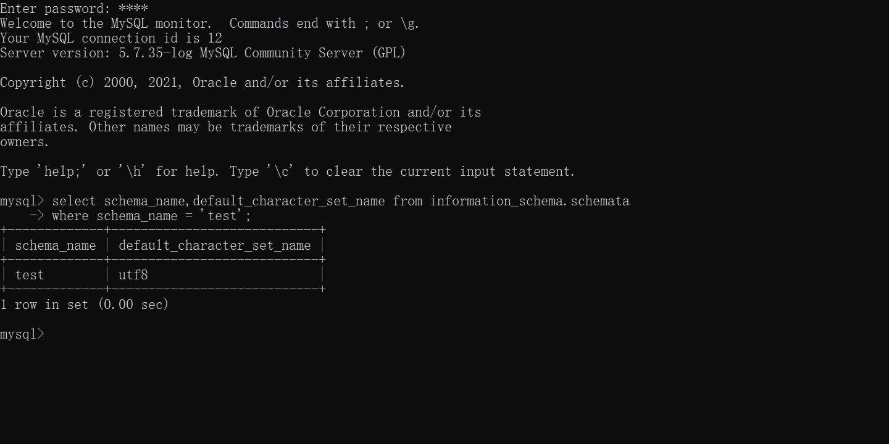

# SQL 语言

## 概念
+ 分类：
  + DQL数据查询语言
  + DML数据操作语言 *针对表中数据* 
  + DDL数据定义语言 *针对数据库对象*
  + DCL数据控制语言
  + TCL事务控制语言

+ 语言语法
  + SQL不区分大小写
  + 可以单行或者多行书写，用分号结尾

## 创建与删除数据库(DDL)

### 创建
+ 使用DDL语句 
1. 创建数据库
```sql
create database test default character set utf8;
```
2.查看数据库
```sql
show database;
```
3.查看数据库编码
```sql
select schema_name,default_character_set_name from information_schema.schemata
where schema_name = 'test';
```



+ 使用Navicat创建数据库
  + 右键连接选择新建数据库
  + 选择合适的协议并填入名称

### 删除
+ DDL(删除test数据库)
```ddl
drop database test;
```

+ 使用Navicat删除

### 使用数据库
```ddl
create database bjsxt default character set utf8;
use bjsxt;
```

## 数据类型
### 整数类型
|类型|含义(有符号)|
|---|---|
|tinyint(m)|-128 - 127|
|int(m)|$-2^{31} - 2^{31}$|
|bigint(m)|$+-9.22*10^{18}$|

### 浮点类型
|类型|含义|
|---|---|
|float|8位精度 m总个数，d小数位|
|double|16位精度 m总个数，d小数位|

### 字符类型
|类型|含义|
|---|---|
|char||