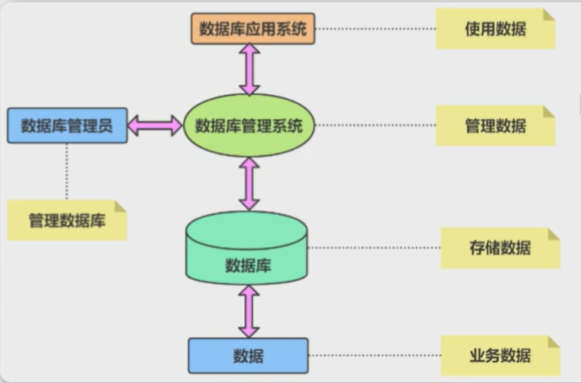
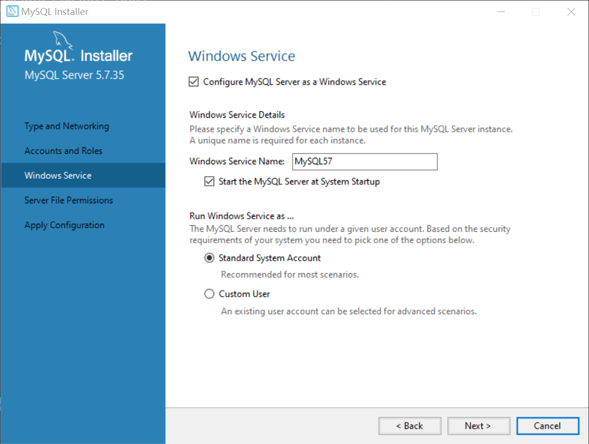
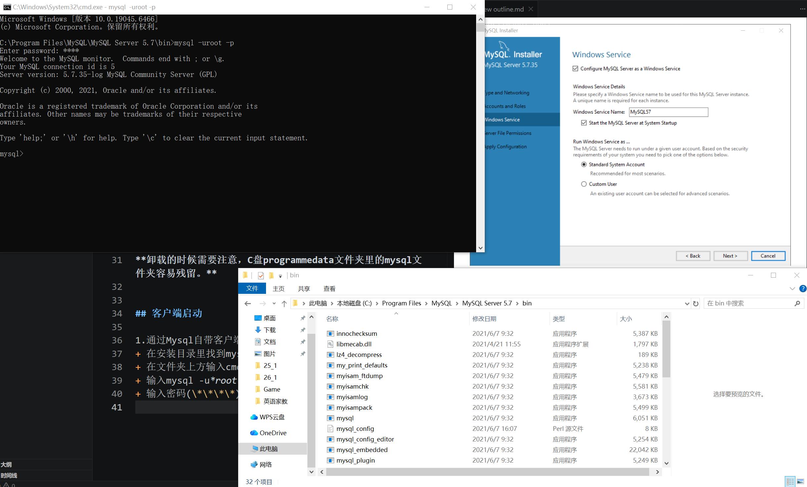
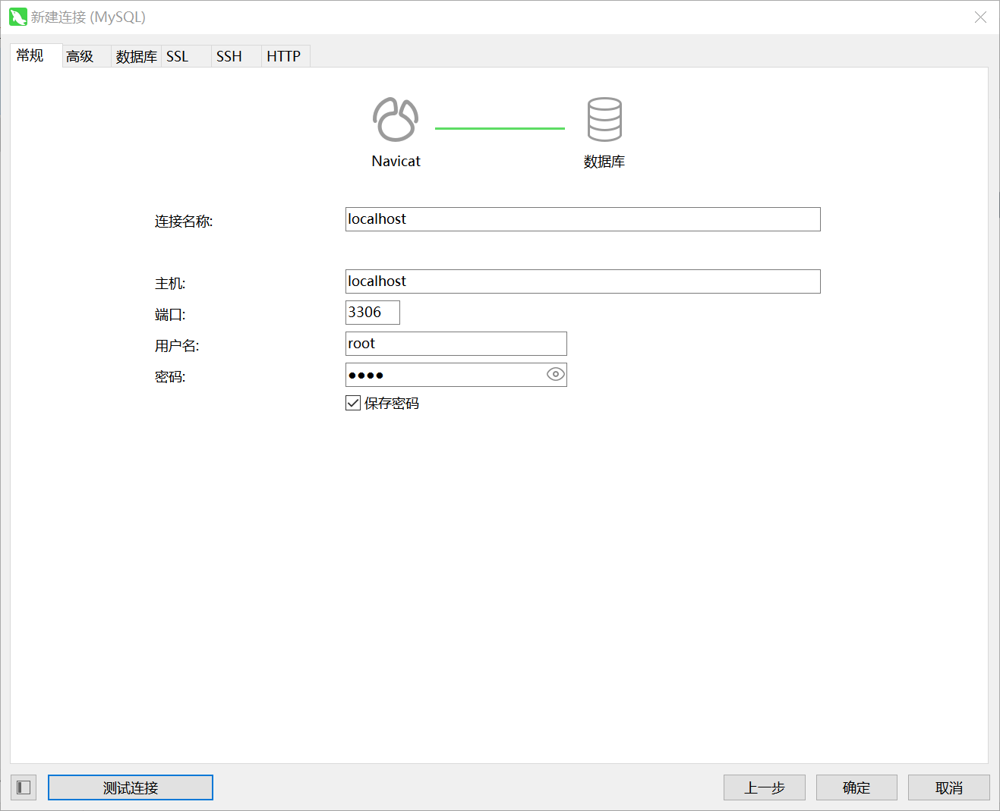

# 

## 数据库概述

### 基本概念
1.数据
+ 有多种表现形式，指对客观事物进行描述并且可以鉴别的符号

2.数据库
+ 数据管理的有效技术，是由一批数据构成的有序集合

3.数据库管理系统
+ 定义和管理数据的软件

4.数据库应用程序
+ 使用数据库管理系统的语法，开发的直接面对最终用户的应用程序

5.数据库管理员
+ 对数据库进行操作的人员，负责运营和维护

## 下载与安装

### 启动

**这里设置的server名称即在windows“计算机管理”里启动的名称**

### 卸载
**卸载的时候需要注意，C盘programmedata文件夹里的mysql文件夹容易残留。**

## 客户端启动

1.通过Mysql自带客户端登陆
+ 在安装目录里找到mysql/bin/mysql.exe
+ 在文件夹上方输入cmd启动终端
+ 输入mysql -u*root*(用户名称) -p回车
+ 输入密码(\*\*\*\*)

2.快捷方式启动
+ 搜索应用程序mysql
+ 两个终端任选进入后输入密码
  
3.Navicat 连接
+点击链接输入数据即可

