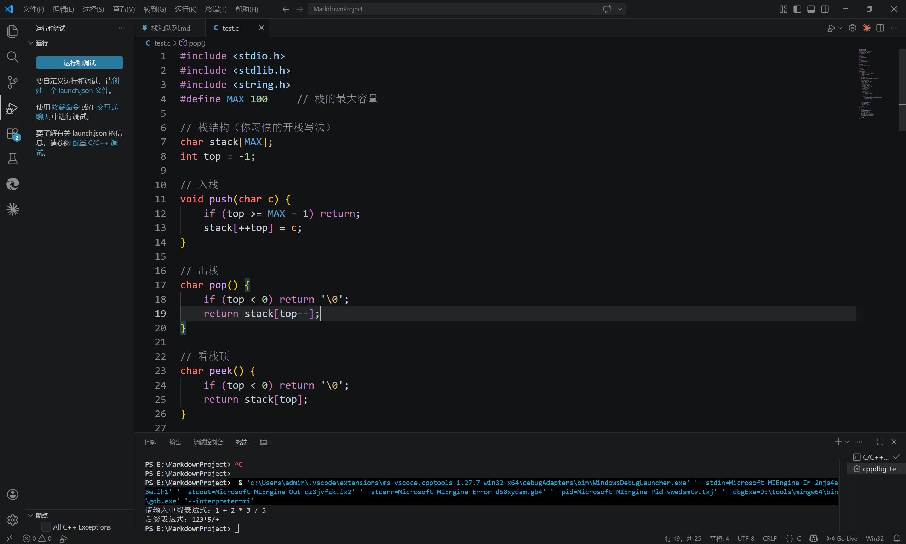

# 栈和队列

## 栈(先进后出)

### 分类
+ 顺序栈
+ 链栈

### 中缀转后缀

1.概念：
+ 中缀是人类使用的表达式
+ 后缀是机器读的表达式

2.思路：
+ 数字直接输出
+ 左括号入栈
+ 右括号弹到左括号
+ 运算符按优先级弹栈再入栈
+ 最后清空栈
  
3.运算符入栈弹出的规则：
**只要满足下面 3 个条件，就一直弹出栈顶**(弹出后输出)
+ (1)栈 不为空
+ (2)栈顶 不是左括号 `(`
+ (3)当前运算符优先级 ≤ 栈顶运算符优先级

**若全都不满足，则入栈**
代码设计：
#### 点击跳转至代码设计[code1](#code1)



#### 特别注意top的使用：
```c
int top = 0;//初始化为0，空栈也为零
stack[top++] = write ;//写入 
putout(stack[--top]);//pop出

```


## 使用场景：
+ 回溯(迷宫问题)
+ 函数调用，模拟非递归

## 队列(先进先出)

### 概念


### 实现
+ 普通队列:

```c
#define MAX 100

int queue[MAX];
int front = 0;   // 队首（要出队的位置）
int rear = 0;    // 队尾（下一个入队的位置）

// 入队
void enqueue(int x) {
    if (rear == MAX) return; // 队满
    queue[rear++] = x;
}

// 出队
int dequeue() {
    if (front == rear) return -1; // 队空
    return queue[front++];
}

// 取队首
int getFront() {
    if (front == rear) return -1;
    return queue[front];
}
```

+ 循环队列:

```c
#define MAX 5

int queue[MAX];
int front = 0;
int rear = 0;

int isFull() {
    return (rear + 1) % MAX == front;
}

int isEmpty() {
    return front == rear;
}

void enqueue(int x) {
    if (isFull()) return;
    queue[rear] = x;
    rear = (rear + 1) % MAX;
}

int dequeue() {
    if (isEmpty()) return -1;
    int val = queue[front];
    front = (front + 1) % MAX;
    return val;
}
```

### 解决问题
+ 1.排队问题
+ 2.打印机打印任务


## 代码模块

### 中缀转后缀并运算{#code1}
+ 1.转换
```c

#define MAX 100     // 栈的最大容量

// 反转字符串（中缀转前缀必须用）
void reverse(char* s) {
    int len = strlen(s);
    int i = 0, j = len - 1;
    while (i < j) {
        char temp = s[i];
        s[i] = s[j];
        s[j] = temp;
        i++;
        j--;
    }
}


// 栈结构（你习惯的开栈写法）
char stack[MAX];
int top = -1;

// 入栈
void push(char c) {
    if (top >= MAX - 1) return;
    stack[++top] = c;
}

// 出栈
char pop() {
    if (top < 0) return '\0';
    return stack[top--];
}

// 看栈顶
char peek() {
    if (top < 0) return '\0';
    return stack[top];
}

// 判断栈空
int isEmpty() {
    return top == -1;
}

// 运算符优先级
int priority(char op) {
    if (op == '*' || op == '/') return 2;
    if (op == '+' || op == '-') return 1;
    if (op == '(') return 0;
    return 0;
}

// 中缀转后缀（核心）
char* infixToPostfix(char* infix) {
    char* postfix = (char*)malloc(MAX * sizeof(char));
    int j = 0;
    int len = strlen(infix);

    for (int i = 0; i < len; i++) {
        char c = infix[i];

        // 跳过空格
        if (c == ' ') continue;

        // 1. 数字 → 直接输出
        if (c >= '0' && c <= '9') {
            postfix[j++] = c;
        }
        // 2. 左括号 → 入栈
        else if (c == '(') {
            push(c);
        }
        // 3. 右括号 → 弹出直到 (
        else if (c == ')') {
            while (!isEmpty() && peek() != '(') {
                postfix[j++] = pop();
            }
            pop(); // 把 ( 弹掉，不保存
        }
        // 4. 运算符 + - * /
        else {
            while (!isEmpty() && priority(c) <= priority(peek())) {
                postfix[j++] = pop();
            }
            push(c);
        }
    }

    // 把栈里剩下的运算符全部弹出
    while (!isEmpty()) {
        postfix[j++] = pop();
    }

    postfix[j] = '\0';
    return postfix;
}

int main() {
    char read[MAX];
    printf("请输入中缀表达式：");
    fgets(read, MAX, stdin);

    // 去掉 fgets 读到的换行符
    read[strcspn(read, "\n")] = '\0';

    char* postfix = infixToPostfix(read);
    printf("后缀表达式：%s\n", postfix);

    free(postfix);
    return 0;
}
```

+ 2.运算